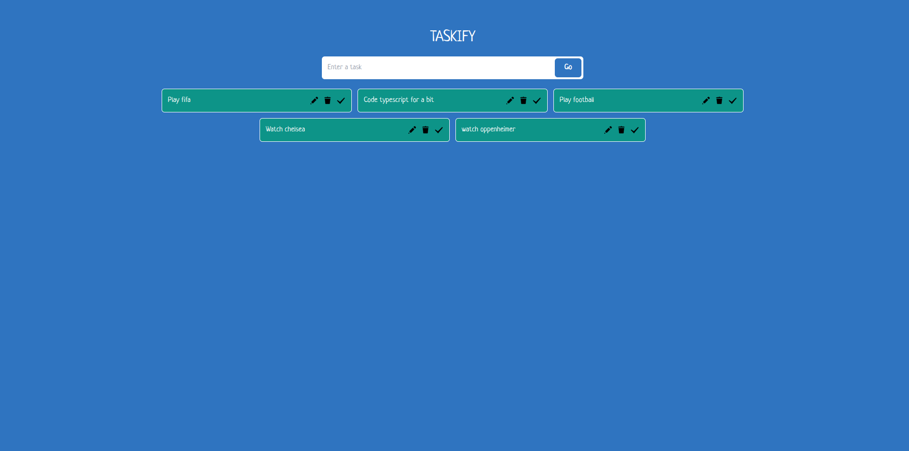

# Taskify - Task Management App

Taskify is a simple task management app built with React, TypeScript, Vite, and Tailwind CSS. With Taskify, you can effortlessly create, delete, edit, and mark tasks as done. The app utilizes local storage to persist your tasks, ensuring that your tasks are saved even when you close the browser.

## Preview

## Features

- Create tasks: Easily add new tasks to your to-do list.
- Delete tasks: Remove tasks you no longer need.
- Edit tasks: Modify task details as needed.
- Mark tasks as done: Keep track of completed tasks.
- Local storage: Your tasks are saved locally, so you don't lose them when you close the app.

## Live URL

You can access Taskify live at [https://khalteck-taskify.netlify.app](https://khalteck-taskify.netlify.app).
